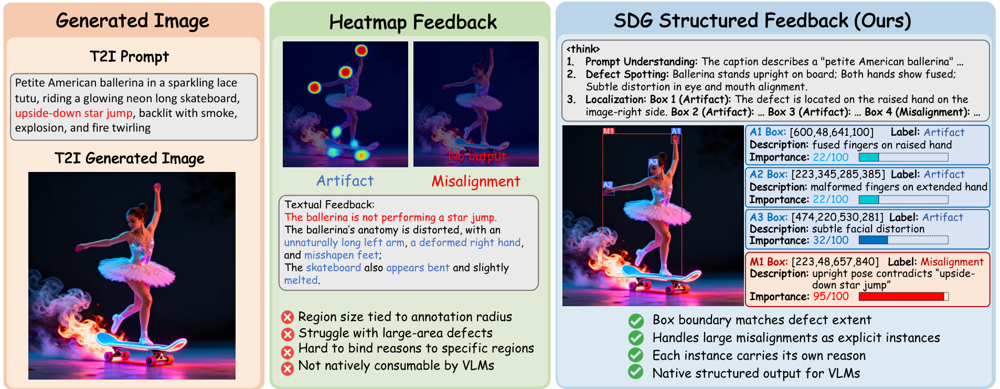
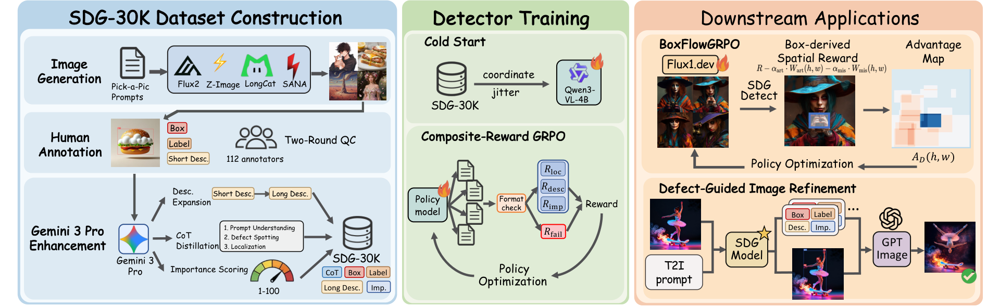
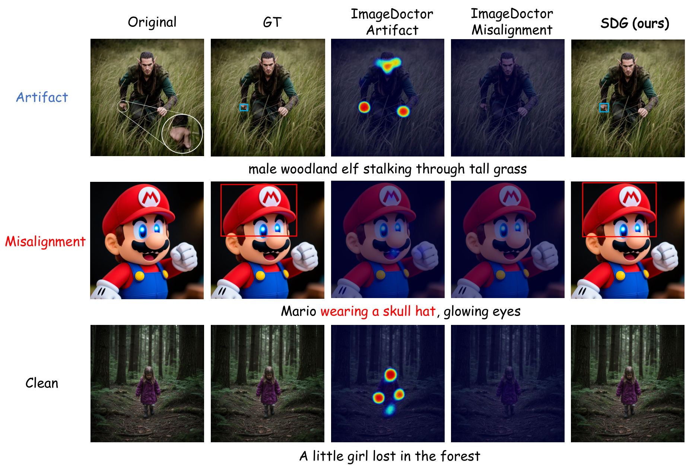

# Where, What, Why, and Importance: Structured Defect Grounding for Text-to-Image Feedback

Official implementation of **Where, What, Why, and Importance: Structured
Defect Grounding for Text-to-Image Feedback**.

[](https://arxiv.org/abs/2606.06113)
[](https://huggingface.co/datasets/P1n3/SDG-30K)
[](https://huggingface.co/collections/P1n3/sdg)
[](LICENSE)

## Overview

Modern text-to-image (T2I) models often fail through **localized, subtle, and
structurally complex defects**. Existing scalar rewards and heatmap-centric
feedback are useful, but they do not naturally describe a variable number of
defect instances or bind each region to a semantic explanation.

**Structured Defect Grounding (SDG)** addresses this by turning T2I diagnosis
into structured set prediction. Each defect is represented as a tuple:

```text
(where, what, why, importance)
```

This gives the model instance-level feedback that is both interpretable and
actionable: it localizes the problematic region, names the defect type, explains
why it is defective, and estimates its severity.

<p align="center">
  
</p>

## Key Features

- **Structured Defect Grounding.** SDG predicts localized defect sets in a
  `<think>...</think><answer>[...]</answer>` format, covering both visual
  artifacts and text-image misalignments.
- **[SDG-30K Dataset](https://huggingface.co/datasets/P1n3/SDG-30K).** A
  30K-image benchmark with box-grounded annotations, natural-language reasons,
  and importance scores across four modern T2I generators, collected
  through approximately **1,085 person-hours** of human annotation.
- **SDG Detector.** A Qwen3-VL detector trained with SFT and GRPO to produce
  instance-level feedback over generated images.
- **SDG-Eval.** A dedicated evaluation protocol for image-level defect typing,
  defect-level localization, reason similarity, and importance accuracy.
- **BoxFlow-GRPO.** A diffusion RL algorithm that converts SDG detector outputs
  into importance-weighted spatial rewards for aligning FLUX.1-dev.
- **Defect-Guided Refinement.** The structured feedback can also drive
  localized editing/refinement by telling downstream editors what to fix and
  where to fix it.

| Pipeline | What it trains | Framework | GPUs (paper) |
|----------|----------------|-----------|--------------|
| **Detector SFT** | Qwen3-VL-4B → structured `<think>/<answer>` defect boxes | [ms-swift](https://github.com/modelscope/ms-swift) `swift sft` | 2×8 |
| **Detector GRPO** | RL-tune the detector with the `SDG_combined` reward | ms-swift `swift rlhf` (+ colocated vLLM) | 2×8 |
| **BoxFlow-GRPO** | RL-align FLUX.1-dev using detector-derived spatial rewards | Flow-Factory fork + SGLang reward servers | 2×8 |

<p align="center">
  
</p>

## Key Results

### Structured Defect Grounding on SDG-30K

SDG improves instance-level defect grounding over strong proprietary VLMs. The
table reports selected defect-level metrics from the SDG-30K test set.

| Model | Artifact BoxF1@0.5 | Artifact DescCos@0.1 | Artifact ImpAcc@0.1 | Misalignment BoxF1@0.5 | Misalignment DescCos@0.1 | Misalignment ImpAcc@0.1 |
|-------|--------------------|----------------------|----------------------|------------------------|--------------------------|--------------------------|
| GPT-5.4 | 0.035 | 0.868 | 0.812 | 0.292 | 0.837 | 0.820 |
| Gemini 3 Pro | 0.200 | 0.885 | 0.824 | 0.307 | 0.891 | 0.851 |
| **SDG (SFT)** | 0.255 | **0.904** | 0.883 | 0.376 | **0.893** | 0.892 |
| **SDG (GRPO)** | **0.263** | **0.904** | **0.887** | **0.387** | 0.888 | **0.893** |

<p align="center">
  
</p>

### BoxFlow-GRPO for T2I Alignment

BoxFlow-GRPO is the only compared RL variant that improves all five reported
downstream dimensions over the FLUX.1-dev base model.

| Method | Reward | PickScore | CLIPScore | HPSv3 | DeQA | P(real) | Avg. Rel. Change |
|--------|--------|-----------|-----------|-------|------|---------|------------------|
| Base | -- | 22.84 | 0.912 | 11.75 | 0.876 | 0.211 | -- |
| Flow-GRPO | UR2 | 22.78 | 0.908 | 11.27 | **0.882** | 0.149 | -6.7% |
| Flow-GRPO | ImageDoctor | **23.17** | 0.937 | **12.23** | 0.857 | 0.201 | +0.3% |
| DenseFlow-GRPO | ImageDoctor | 22.88 | **0.945** | 11.57 | 0.864 | 0.199 | -1.0% |
| **BoxFlow-GRPO** | **UR2 + SDG** | 22.91 | 0.915 | 12.14 | 0.877 | **0.228** | **+2.4%** |

> **Status — reproduced from scratch.** All three pipelines were validated
> end-to-end with fresh conda envs on 8× H20 (driver 575 / CUDA 12.9): detector
> SFT (loss ↓, full checkpoint saved), detector GRPO (custom `SDG_combined`
> reward computed via colocated vLLM, checkpoint saved), and FLUX BoxFlow-GRPO
> (FLUX sampling → SGLang detector + UnifiedReward servers → dense spatial
> advantage → GRPO update, checkpoint saved). Verified stack: ms-swift 4.3.0 /
> vLLM 0.11.0 / sglang 0.5.10 / torch 2.8.0+cu126 / transformers 5.10.2.

## Released Artifacts

| Type | Repo |
|------|------|
| Dataset | [`P1n3/SDG-30K`](https://huggingface.co/datasets/P1n3/SDG-30K) |
| Detector (SFT, full) | [`P1n3/sdg-detector-sft`](https://huggingface.co/P1n3/sdg-detector-sft) |
| Detector (GRPO, merged full checkpoint) | [`P1n3/sdg-detector-grpo`](https://huggingface.co/P1n3/sdg-detector-grpo) |
| FLUX BoxFlow-GRPO LoRA | [`P1n3/boxflow-grpo-flux-lora`](https://huggingface.co/P1n3/boxflow-grpo-flux-lora) |

---

## Repository Layout

```text
.
├── README.md                       this file (top-level reproduction guide)
├── env/                            from-scratch environment setup
│   ├── setup.sh                    creates the conda envs below
│   └── requirements*.txt           pinned, verified dependency sets
├── sdg_detector/                   detector SFT + GRPO (ms-swift)
│   ├── scripts/                    train_sft.sh, train_grpo.sh, plugin.py (reward)
│   ├── data_prep/                  build training JSONLs from the release
│   ├── preprocess/                 ms-swift dataset format converters
│   └── inference/                  batched detector inference + baselines
├── boxflow_grpo/                   FLUX BoxFlow-GRPO (flow-factory fork)
│   ├── flux1_dev_exp1_AB.yaml      headline run config
│   ├── scripts/dense_grpo/         start_servers_A.sh, train_B.sh
│   └── src/flow_factory/           the training library (pip install -e .)
├── eval/                           SDG-Eval metrics
└── refinement/                     defect-guided refinement utilities
```

## Environment Contract

Everything is driven by a handful of environment variables — no paths are
hard-coded in the scripts:

```bash
export SDG_HOME=/path/to/SDG               # this repo
export SDG_DATA=$SDG_HOME/data             # datasets live here
export SDG_CKPT=$SDG_HOME/checkpoints      # training outputs / released ckpts
export ENVS_ROOT=$HOME/sdg-envs            # where the conda envs are created
export HF_HOME=$SDG_HOME/.cache/huggingface
```

Three isolated conda environments are used (their CUDA stacks conflict, so they
must stay separate):

| env | created at | runs |
|-----|-----------|------|
| `sdg-core` | `$ENVS_ROOT/sdg-core` | detector SFT + GRPO, eval, the reward plugin |
| `sglang` | `$ENVS_ROOT/sglang` | the two SGLang reward servers (BoxFlow-GRPO Server A) |
| `flow-factory` | `$ENVS_ROOT/flow-factory` | FLUX BoxFlow-GRPO training (`ff-train`, Server B) |

Create them all with:

```bash
bash env/setup.sh            # all three
# or a subset:
bash env/setup.sh core
bash env/setup.sh sglang flow-factory
```

> The exact, verified package versions are pinned in `env/requirements*.txt`.
> Qwen3-VL requires a recent `transformers`/`ms-swift`; the pins reflect what
> actually trains, not the historical versions.

Verify CUDA is visible in each env (must print `True`):

```bash
for e in sdg-core sglang flow-factory; do
  "$ENVS_ROOT/$e/bin/python" -c "import torch;print('$e', torch.__version__, torch.cuda.is_available())"
done
```

## Download Data and Models

```bash
huggingface-cli login    # or: export HF_TOKEN=...

# Dataset (~30K PNGs + annotations, large; resumes if interrupted)
huggingface-cli download P1n3/SDG-30K --repo-type dataset \
    --local-dir $SDG_DATA/SDG-30K

# Released detector checkpoints (SFT + directly loadable GRPO detector)
huggingface-cli download P1n3/sdg-detector-sft       --local-dir $SDG_CKPT/sdg-detector-sft
huggingface-cli download P1n3/sdg-detector-grpo --local-dir $SDG_CKPT/sdg-detector-grpo
huggingface-cli download P1n3/boxflow-grpo-flux-lora --local-dir $SDG_CKPT/boxflow-grpo-flux-lora
```

Base models pulled automatically by the framework (or pre-download into `HF_HOME`):
`Qwen/Qwen3-VL-4B-Instruct`, `Qwen/Qwen3-Embedding-0.6B`,
`black-forest-labs/FLUX.1-dev`, `CodeGoat24/UnifiedReward-2.0-qwen3vl-2b`.

### Build the training JSONLs

The release ships raw `train.jsonl`/`test.jsonl`. Convert them into the
ms-swift SFT and GRPO formats (resolves image paths to absolute, keeps GT boxes
for the reward):

```bash
"$ENVS_ROOT/sdg-core/bin/python" sdg_detector/data_prep/prepare_release_datasets.py \
    --input        $SDG_DATA/SDG-30K/annotations/train.jsonl \
    --dataset_root $SDG_DATA/SDG-30K \
    --require_image
# -> annotations/train_swift_sft.jsonl   (SFT: messages + assistant CoT)
# -> annotations/train_swift_grpo.jsonl  (GRPO: prompt + GT boxes)
```

For the paper's coordinate-jitter augmentation (±10px, 3 epochs pre-baked):

```bash
"$ENVS_ROOT/sdg-core/bin/python" sdg_detector/scripts/prepare_coord_jitter_data.py \
    --input_sft   $SDG_DATA/SDG-30K/annotations/train_swift_sft.jsonl \
    --output_jsonl $SDG_DATA/SDG-30K/annotations/train_swift_sft_jitter.jsonl \
    --num_epochs 3 --jitter 10
```

## Reproduce Pipeline 1: Detector SFT

```bash
export PATH="$ENVS_ROOT/sdg-core/bin:$PATH"   # so `swift` resolves

# Single node (8 GPU):
DATASET_PATH=$SDG_DATA/SDG-30K/annotations/train_swift_sft.jsonl \
  bash sdg_detector/scripts/train_sft.sh

# Multi-node (paper: 2×8):
#   master:  NNODES=2 MASTER_ADDR=<ip> bash sdg_detector/scripts/train_sft.sh 0
#   worker:  NNODES=2 MASTER_ADDR=<ip> bash sdg_detector/scripts/train_sft.sh 1
```

Smoke test (a few steps, two GPUs):

```bash
MAX_STEPS=10 NPROC_PER_NODE=2 CUDA_VISIBLE_DEVICES=2,3 ATTN_IMPL=sdpa \
DATASET_PATH=$SDG_DATA/SDG-30K/annotations/train_swift_sft.jsonl \
  bash sdg_detector/scripts/train_sft.sh
```

## Reproduce Pipeline 2: Detector GRPO

GRPO starts from a Stage-1 SFT checkpoint. Use your SFT output, or the released
`sdg-detector-sft` to RL-tune directly.

```bash
export PATH="$ENVS_ROOT/sdg-core/bin:$PATH"

MODEL_PATH=$SDG_CKPT/sdg-detector-sft \
DATASET_PATH=$SDG_DATA/SDG-30K/annotations/train_swift_grpo.jsonl \
  bash sdg_detector/scripts/train_grpo.sh           # single node 8 GPU
```

The reward `SDG_combined_v3` (`sdg_detector/scripts/plugin.py`) is
`0.6·DIoU + 0.25·DescCos + 0.15·ImpAcc` behind a format gate; DescCos uses
`Qwen/Qwen3-Embedding-0.6B` (override with `SDG_EMBED_MODEL`).

Smoke test:

```bash
MAX_STEPS=5 NPROC_PER_NODE=4 VLLM_TP=4 CUDA_VISIBLE_DEVICES=2,3,4,5 ATTN_IMPL=sdpa \
NUM_GENERATIONS=4 PER_DEVICE_BATCH=2 \
MODEL_PATH=$SDG_CKPT/sdg-detector-sft \
DATASET_PATH=$SDG_DATA/SDG-30K/annotations/train_swift_grpo.jsonl \
  bash sdg_detector/scripts/train_grpo.sh
```

## Reproduce Pipeline 3: FLUX BoxFlow-GRPO

Two roles (can be two nodes, or one 8-GPU node split 4/4 for a smoke test):

**Server A — reward endpoints.** The released GRPO detector is already merged
with the SFT checkpoint and can be served directly:

```bash
BBOX_MODEL=$SDG_CKPT/sdg-detector-grpo \
  bash boxflow_grpo/scripts/dense_grpo/start_servers_A.sh
# bbox detector -> :17142, UnifiedReward-2.0 -> :17141
```

**Server B — training.** Point the reward URLs in
`boxflow_grpo/flux1_dev_exp1_AB.yaml` at Server A's IP, provide a prompt set
under `data.dataset_dir` (a `train.txt` of prompts, or `train.jsonl`), then:

```bash
export PATH="$ENVS_ROOT/flow-factory/bin:$PATH"
SERVER_A_IP=<ip> bash boxflow_grpo/scripts/dense_grpo/train_B.sh
```

See [`boxflow_grpo/README.md`](boxflow_grpo/README.md) for the full reward/
trainer description and hyper-parameters.


## License

Repository code: Apache-2.0 (the `boxflow_grpo/` subtree keeps its upstream
Flow-Factory Apache-2.0 license). Dataset, generated images and model weights
are governed by their own licenses — see [`ASSET_LICENSES.md`](ASSET_LICENSES.md).

## Citation

If you use SDG, the SDG-30K dataset, or the released checkpoints, please cite:

```bibtex
@article{zhang2026and,
  title={Where, What, Why, and Importance: Structured Defect Grounding for Text-to-Image Feedback},
  author={Zhang, Huaisong and Yu, Hao and Zhang, Yuxuan and Wang, Jiahe and Chen, Xinrui and Cao, Haoxiang and Lu, Feng and Zhang, Wendong and Yu, Changqian and Yuan, Chun},
  journal={arXiv preprint arXiv:2606.06113},
  year={2026}
}
```
